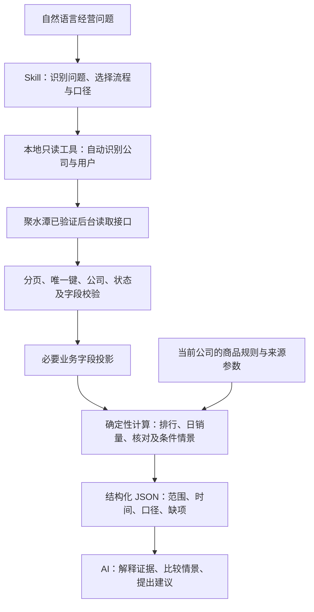

# jst-ai-agent · 聚水潭 AI 经营分析 Skill

把聚水潭已有的商品、销售、库存、采购和加工数据，转成可以追溯的经营分析。

`jst-ai-agent` 由 **Skill 分析规范 + 本地只读查询工具 + 确定性计算模块**组成。用户用自然语言提出经营问题，AI 选择合适的流程，本地工具读取当前登录公司的数据、校验并计算，AI 再解释结果、列出缺项和行动建议。

公司和用户从登录会话自动识别，不绑定特定企业或员工。切换公司后重新查询，使用新的身份；企业规则、情景参数和报告按公司隔离。

> 当前登录接入支持 **macOS + Google Chrome**，建议 Python 3.12。Windows/Linux 认证、WorkBuddy 一键连接尚未实现；WorkBuddy 中的完整运行流程仍需实机验收。补货输出是带来源参数的条件情景，不能直接作为已批准的采购或排产指令。

[下载技能包](https://github.com/towardsyoung/jst-ai-agent/releases/latest/download/jst-ai-agent.zip) · [查看 Skill](skills/jst-ai-agent/SKILL.md) · [登录与公司切换](skills/jst-ai-agent/references/session-access.md)

## 亮点与价值

- **自然语言直达业务问题。** 在售数量、月销量排行、近期日销量、库存错配和采购加工未结核对都有对应入口，减少反复导表和临时拼口径的工作。
- **数值由代码计算，解释有证据。** 分页、去重、状态过滤、库存公式和补货试算由本地工具完成；AI 负责解释、比较情景和组织下一步核对。
- **自动识别登录公司。** 复用客户本机已有的 Chrome 登录会话，无需手工查公司 ID、填写用户 ID 或复制 Cookie。支持显式选择 Chrome Profile。
- **完整性与业务缺项分别展示。** 分页截断、重复、返回公司不一致或未知状态会阻止成功统计；单位、货权、预计到货等缺项会保留在结果中。
- **库存口径清楚。** 区分含虚拟库存的可用数、实际库存扣订单占用、套装装配能力，避免重复扣订单或把共享组件当成多份实物库存。
- **补货同时看数量和时间。** 使用完整日订单基线，核对有效账面供给与有来源的可销售批次，展示总量及到货前的缺口；缺交期或商品规则时给数据准备清单。
- **分析方法可持续复用。** 将读取、计算、模块流程和交付规范分层维护，后续接入售后、成本、多仓或生产批次时可以沿用已验证能力。

## 可以解决哪些问题

| 业务问题 | 当前入口 | 能得到什么 |
| --- | --- | --- |
| 当前系统有多少在售商品？ | `onsale-count` | 启用且可用数大于 0 的 SKU 数，普通商品与组合装分别展示 |
| 本月或指定月份什么商品卖得最好？ | `sales-top` | 有效销售订单件数排行、订单数、统计期间与排除口径 |
| 商品和当前库存资料是否完整？ | `catalog` | 商品目录、主仓库存字段、单位/类型/货权缺项 |
| 近期 SKU 日销量如何变化？ | `sales-lines` / `sales-daily` | 有效销售明细投影、连续日序列和未完日标记 |
| 哪些商品有销售但库存不足，或有库存但未见销售？ | `stock-sales` | 销售与当前库存关联后的核对候选及判断限制 |
| 哪些采购或加工单需要跟进？ | `supply-review` | 当前未结、分批净收、账面剩余、旧单与预计日期缺项 |
| 某张采购/加工单的数量能否对上？ | `purchase-lines` / `manufacture-lines` | SKU 明细与收货净量核对；加工原料按单号关联 |
| 在给定交期和批次下，何时有缺口、补多少？ | `replenishment-plan` | 有来源参数的逐日缺口、到货前缺口和补货/补产条件数量 |

库存无本期销售只能形成核对候选；判断呆滞还需要库龄、新品/季节品、消耗和成本证据。采购/加工账面未结也不等于实物在途或车间在制。

**目前不提供**完整售后净销量、完整毛利/净利、多仓历史周转、逐工序排程、人效工资或公司全部历史数据。新增能力要先核对真实源接口、权限、字段与业务口径。

## 架构



| 层 | 职责 | 主要文件 |
| --- | --- | --- |
| Skill | 分析流程、指标口径、数据门槛、回答规范、按需加载参考 | `skills/jst-ai-agent/` |
| 会话与读取 | Chrome 会话、身份固定、只读接口、分页与返回校验 | `jushuitan.py` |
| 销售与库存计算 | 白名单投影、商品规则、销售明细/日序列、库存错配 | `jst_analysis.py` |
| 供给核对 | 采购、加工、分批收货、账面剩余与原料关联 | `jst_supply.py` |
| 补货情景 | 完整日基线、向前数量验证、批次与逐日缺口 | `jst_replenishment.py` |
| 打包与回归 | 明确文件清单打包、构造会话和业务数据验证 | `scripts/build_skill.py`、`tests/` |

当前读取的是已核实的 ERP 后台只读接口及页面回调，使用客户自己的有效会话。项目没有接入聚水潭开放平台企业授权，也没有建立后台服务、定时采集或数据库缓存。每次命令重新查询；各数据域的读取时刻可能不同，结果不是跨域事务快照。

## 快速开始：macOS 本地查询

### 1. 获取代码和准备运行环境

先准备 Python 3.12，然后执行：

```sh
git clone https://github.com/towardsyoung/jst-ai-agent.git
cd jst-ai-agent
JST_PYTHON=python3.12 sh skills/jst-ai-agent/scripts/setup.sh
```

`JST_PYTHON` 可以换成你实际安装的 Python 可执行文件；如果环境中的 `python3` 已合适，也可直接运行 `sh skills/jst-ai-agent/scripts/setup.sh`。脚本在项目中创建 `.venv` 并安装依赖，不读取浏览器或 ERP 数据。

### 2. 正常登录聚水潭

在 Chrome 的目标 Profile 中登录聚水潭并选择公司。密码、扫码和验证码由用户在正常登录页面完成。若 macOS 提示钥匙串访问权限，由用户处理系统提示；不要把 Cookie 或密码粘贴给 AI。

```sh
./query.sh session-check
```

成功时返回当前 `company_id`、`user_id` 和商品接口查询状态。这个检查不证明其他数据域都有权限，也不是全量商品计数。

多个 Chrome Profile 时指定目录名，后续查询也使用同一选项：

```sh
./query.sh session-check --chrome-profile "Profile 1"
./query.sh sales-top --chrome-profile "Profile 1" --limit 10
```

Profile 是 Chrome 目录名，不是账号显示名称。工具不会自动扫描其他账号。

### 3. 运行分析

```sh
# 在售 SKU 数：普通商品和组合装分开展示
./query.sh onsale-count

# 本月有效订单销量排行
./query.sh sales-top --limit 10

# 指定自然月
./query.sh sales-top --month 2026-09 --limit 20

# 当前商品与库存字段，以及近 30 天销售/库存核对
./query.sh catalog --limit 10
./query.sh sales-daily --days 30 --limit 10
./query.sh stock-sales --days 30 --limit 10

# 当前未结采购、加工与收货核对
./query.sh supply-review --limit 10
./query.sh supply-review --kind manufacture --age-days 120

# 无额外参数时，保留事实、基线和缺项，不编采购数量
./query.sh replenishment-plan --days 56 --horizon 30 --limit 10
```

`--limit` 只限制显示行数，范围内完整读取和计算不变。指定商品时使用 `--sku 真实SKU`；核对指定单据时使用 `purchase-lines` 或 `manufacture-lines` 的 `--document-id 真实单号`。

需要保存分析结果时，先创建本地目录，再提供一个尚不存在的文件名：

```sh
mkdir -p reports
./query.sh stock-sales --days 30 --output reports/stock-sales-new.json
```

文件仅保存必要的业务投影和结果；已有文件不会覆盖。报告是历史快照，之后询问实时问题要重新运行。

## 在 Skill 客户端中使用

入口是 [SKILL.md](skills/jst-ai-agent/SKILL.md)。安装后可提出：

- “当前公司有多少在售 SKU？普通商品和组合装分开展示。”
- “按有效订单件数，列出本月销量前十的商品。”
- “核对最近 30 天有销售但当前主仓库存不足的商品，并列出数据缺项。”
- “列出需要跟进的加工未结单，区分账面剩余和预计可销售供给。”
- “按我提供的交期和可销售批次，试算补货数量及到货前缺口。”

Skill 指引客户端运行本地工具，并根据 JSON 结果说明证据、口径和行动。运行工具需要客户端具备本地脚本执行能力，并取得用户对目标公司只读查询的授权。

### WorkBuddy

WorkBuddy 官方支持通过“添加技能 → 上传技能”导入本地技能包，见 [官方技能说明](https://www.codebuddy.cn/docs/workbuddy/From-Beginner-to-Expert-Guide/Function-Description/Skills-Market)。

1. 从 [Releases](https://github.com/towardsyoung/jst-ai-agent/releases) 下载 `jst-ai-agent.zip` 并导入。
2. 在**客户端实际安装的技能目录**执行 `sh scripts/setup.sh`，准备本地运行依赖；可以让客户端定位该技能并执行安装步骤。
3. 执行该目录的 `scripts/query.sh session-check`，确认登录身份和商品接口可读。
4. 再通过自然语言提出业务问题。

技能包附带 `runtime/` 运行源文件和依赖清单，未附 Python 或已安装的虚拟环境。**导入成功不等于运行环境已安装。** 本项目尚未在 WorkBuddy 中完成实机验收；当前没有 WorkBuddy 托管 CLI、一键登录或 Windows 认证实现。

### 自行打包

```sh
python3 scripts/build_skill.py
```

生成 `dist/jst-ai-agent.zip`。打包采用明确文件清单，包含 Skill 和同源运行代码，排除企业规则、案例、报告、凭证和个人虚拟环境。源码中的 Skill 目录单独复制不包含运行代码；可使用完整包，或让 `JST_AI_HOME` 指向配套查询工具的根目录。

## 企业规则与补货参数

**登录身份自动获取，经营规则由当前公司的数据和确认依据提供。**

商品类型、货权和单位默认从以下本地位置读取：

```text
config/companies/<session-check 返回的 company_id>/sku-rules.json
```

没有文件时视为无本地确认规则，继续基础读取并标明未知项。也可以显式指定 `--sku-rules /路径/规则.json`；文件的 `company_id` 必须匹配本次会话。

[商品规则结构与流程](skills/jst-ai-agent/references/sales-stock.md)说明如何记录依据。补货的交期、复核周期、安全量、包装倍数、MOQ 和可销售批次分别声明来源；通过 `--scenario-file` 提供，同样必须匹配当前公司。

`config/replenishment-scenario-example.json` 使用构造公司 `910001` 和 `EXAMPLE-SKU`，所有经营参数均为开发假设，工具不会默认加载。实际使用时按当前公司的真实 SKU 和来源另建文件，不直接套用示例。

```sh
./query.sh replenishment-plan --scenario-file /路径/当前公司的情景.json
```

一次运行固定启动时读取的身份。浏览器随后切换公司不会让正在执行的查询自动跳转；下一次命令重新读取会话。若请求会话身份发生变化或返回其他公司记录，停止输出成功统计。跨公司比较需要分别查询并明确公司标签，不能仅凭相同 SKU 编码关联。

## 默认统计口径与结果边界

- **在售**：已启用且 ERP 可用库存大于 0，按 SKU 计数。普通商品使用主仓公有 `orderable`，组合装使用 `v_stock`；包含虚拟库存，不代表店铺实际上架或可同时出售的实物总量。
- **销量**：按 `order_date` 和上海时区统计有效销售订单件数，排除待付款、赠品、取消/失效单、拆合父单、初始欠款、换货和补发。保留有效拆合结果，套装按套数；不另扣售后退货。
- **期间**：本月从 1 日 00:00 到查询开始时刻，历史月份为自然月，均左闭右开。日销量默认近 30 自然日，含今天已过部分；补货基线默认最近 56 个完整日，排除今天。
- **库存核对**：普通商品实际库存减订单占用，不重复扣本期订单；套装装配能力与组件不能相加。缺字段不填零，多仓/锁定及完整履约仍待核实。
- **供给**：当前非归档未结及收货净量核对。日期缺失、货权/单位未确认、冲回或异常会保留限制；账面剩余不能直接当作按期可销售供给。
- **补货**：直接 SKU 有效订单基线与来源参数的条件情景，始终 `execution_ready=false`。向前数量验证没有历史库存/状态/ETA，不能称完整补货策略回测。

统计成功需要 `ok=true` 且 `complete=true`；`session-check` 只做连接检查，例外不包含完整统计标记。`complete=true` 表示本次请求范围分页通过校验，不能代表公司所有历史、仓库和业务信息齐全。结果同时记录范围、公司、读取时间、排除项和业务缺项。失败返回非零退出码和可读错误。

客户需要实发、售后净销量、收入或完整成本时，另行定义并验证指标，不能用上述默认口径替代。

## 数据与权限

Cookie、钥匙串信息和页面会话字段只在本机内存中处理，不写入配置、Skill、日志或仓库。查询按当前 ERP 账号的实际权限执行；不提供任意接口调用、改库存、改价格、创建采购单或修改订单的入口。

本地代码本身不调用大模型服务。使用 Skill 的 AI 客户端会处理提供给它的结果，数据处理范围取决于该客户端和用户配置。凭证留在本机不意味着分析结果只在本机处理。

公开仓库只包含通用代码、必要分析规范、构造示例和测试，不发布企业案例、历史数据、公司规则、开发创作文档或个人环境。

## 开发与验证

```sh
.venv/bin/python -m unittest discover -s tests -v
python3 scripts/build_skill.py
```

测试使用构造业务数据和会话，不连接真实 ERP。当前包含 73 项回归，覆盖销售过滤、分页、库存口径、分批净收、供给与补货情景、多公司隔离、可迁移入口及公开包内容。

已在初始企业的 macOS Chrome 会话验证基础只读查询；其他企业的权限、模块和字段差异继续按实际响应核对，多公司隔离有构造回归。Windows/Linux、WorkBuddy 实机运行、归档全历史、多仓、售后与完整利润均未宣称已验收。

## 目录

```text
jst-ai-agent/
├── README.md
├── query.sh
├── jushuitan.py
├── jst_analysis.py
├── jst_supply.py
├── jst_replenishment.py
├── requirements.txt
├── config/replenishment-scenario-example.json
├── scripts/build_skill.py
├── skills/jst-ai-agent/
│   ├── SKILL.md
│   ├── agents/openai.yaml
│   ├── scripts/query.sh
│   ├── scripts/setup.sh
│   └── references/
└── tests/
```
